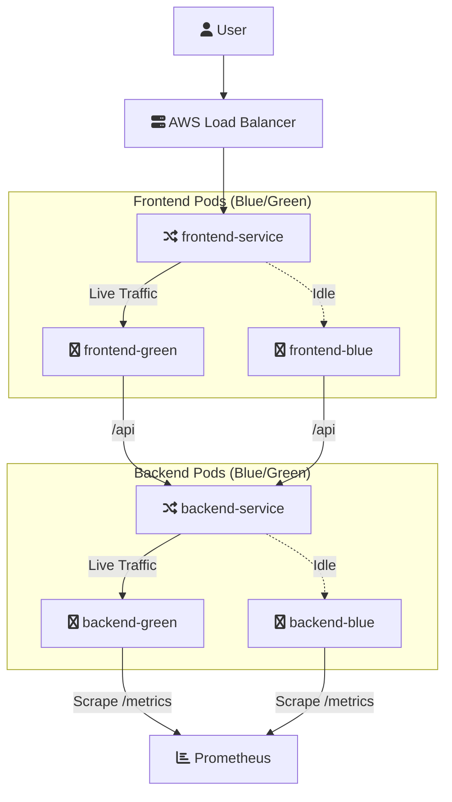
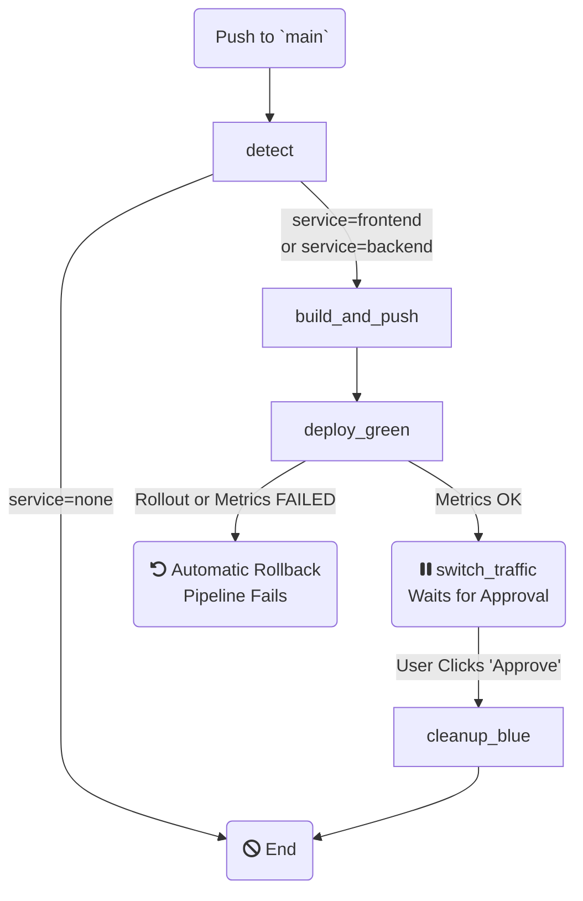

# 🚀 Full Stack Blue-Green Deployment on AWS EKS

This repository contains a full-stack web application (React + Node.js) with a production-grade, metrics-driven **Blue-Green deployment pipeline** powered by **GitHub Actions, AWS ECR, EKS, and Prometheus**.

This automated CI/CD pipeline builds, tests, and deploys new versions of the frontend or backend with **zero downtime**. It features automatic canary analysis, a manual approval gate, and automatic rollback to ensure safe and reliable releases.

---

## ✨ Features

* **Smart Service Detection**: The pipeline automatically detects changes in `frontend/`, `backend/`, or `k8s/` to decide which component to deploy.
* **Zero-Downtime Releases**: The blue-green strategy ensures the live application is never offline during an update.
* **Metrics-Based Canary Test**: The `deploy_green` job performs a 60-second canary test, querying Prometheus for 5xx error rates before allowing the pipeline to continue.
* **Manual Approval Gate**: The pipeline **pauses** after the new version is verified, requiring a manual "Approve" click in GitHub before live traffic is switched.
* **Automatic Rollback on Failure**: If the "green" deployment fails its basic rollout or its metrics-based canary test, the pipeline fails, preventing a bad deployment.
* **Automatic Cleanup**: After a successful traffic switch, the old "blue" deployment is automatically scaled down to 0 replicas to save cluster resources.

---

## 🏗️ Architecture

### Application Architecture

The application is split into two main services running on EKS. The React frontend is served by an Nginx container, which also proxies all `/api/*` requests to the Node.js backend. An AWS Load Balancer directs traffic to the frontend service.



### CI/CD Pipeline Flow

The GitHub Actions workflow is split into five distinct jobs that manage the entire release process, including a manual approval gate before live traffic is switched.



## 🛠️ Technology Stack


| Category | Technology |
| :--- | :--- |
| **Frontend** | React, Vite, Nginx (as reverse proxy) |
| **Backend** | Node.js, Express, `prom-client` (for metrics) |
| **Cloud Provider** | Amazon Web Services (AWS) |
| **CI/CD** | GitHub Actions |
| **Containerization** | Docker, AWS Elastic Container Registry (ECR) |
| **Orchestration** | AWS Elastic Kubernetes Service (EKS) |
| **Monitoring** | Prometheus & Grafana (via `kube-prometheus-stack`) |

---


## 📈 Monitoring with Grafana

The cluster is equipped with a full monitoring stack. You can access the Grafana dashboard to view live metrics from the backend.

### 1. Access the Dashboard

Run ```bash kubectl port-forward ``` to connect to the Grafana service:

```bash kubectl port-forward -n monitoring svc/prometheus-grafana 3000:80 ```

Now, open ```bash http://localhost:3000 ``` in your browser.

### 2. Get Login Credentials

Username: ```bash admin ```
Password: Run this command to get the auto-generated password:
```bash kubectl get secret -n monitoring prometheus-grafana -o jsonpath='{.data.admin-password}' | base64 --decode ```

### 3. Example PromQL Queries
Once logged in, go to the Explore tab and use these queries to monitor your backend:
#### Request Rate (RPS):
```bash
sum(rate(http_request_duration_seconds_count{job="default/backend"}[5m]))
 ```
#### Error Rate (5xx):
```bash
sum(rate(http_request_duration_seconds_count{status_code=~'5..', job="default/backend"}[5m]))
```
#### p95 Latency:
```bash 
histogram_quantile(0.95, sum(rate(http_request_duration_seconds_bucket{job="default/backend"}[5m])) by (le))
```

---
## 🧱 Folder Structure
```bash
my-full-stack-app/
├── backend/
│    ├── Dockerfile
│    ├── server.js
│    ├── package.json
│    └── ...
├── frontend/
│    ├── Dockerfile
│    ├── nginx.conf
│    ├── src/App.jsx
│    └── ...
├── k8s/
│    ├── backend-blue.yaml
│    ├── backend-green.yaml
│    ├── frontend-blue.yaml
│    └── frontend-green.yaml
├── .github/workflows/
│    └── deploy-blue-green.yml
└── README.md
```
---
### 🧩 Kubernetes Configuration Summary
#### Backend
Deployments: ```bash backend-blue ```, ```bash backend-green ```

Service: ```bash backend-service (ClusterIP) ```

Port: 5000

Health Check: ```bash /api/health ```

Metrics Endpoint: ```bash /metrics ``` (annotated for Prometheus)
#### Frontend
Deployments: ```bash frontend-blue ```, ```bash frontend-green ```

Service: ```bash frontend-service ``` (LoadBalancer)

Port: 80

Proxy: ```bash /api/ ``` paths proxied to ```bash backend-service ``` via ```bash nginx.conf ```

---
## 🧪 Verification Commands
Check pod status:
```bash
kubectl get pods -l app=backend,version=green
kubectl get pods -l app=frontend,version=green
```
Check service selector:
```bash
kubectl get svc backend-service -o jsonpath='{.spec.selector}'
kubectl get svc frontend-service -o jsonpath='{.spec.selector}'
```
Check rollout status:
```bash
kubectl rollout status deployment/backend-green
kubectl rollout status deployment/frontend-green
```
